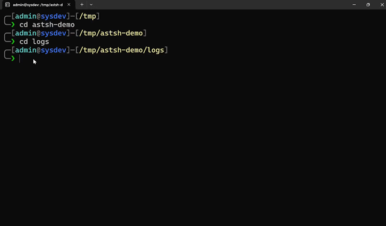
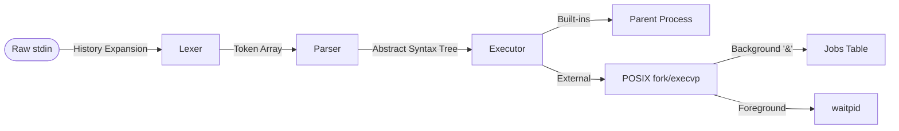

# astsh | AST-Based Command Shell

-blue.svg)


**astsh** is a modular, UNIX-style shell interpreter. Implementing a strict **Lexer ➔ Parser ➔ Executor** pipeline, the shell translates raw input via an FSM-based lexer into an Abstract Syntax Tree (AST) for execution. It manages child process lifecycles, arbitrary-length pipelines, and standard I/O redirection directly via POSIX system calls. Additional features include asynchronous job control, robust signal handling, and state-aware built-ins for directory navigation, command history, and background job tracking.

<div align="center">
  
</div>

## ✨ Core Features

### Pipeline & I/O Execution

* **Arbitrary-Length Pipelines (`|`):** Supports deeply chained commands, strictly managing file descriptors to prevent leaks and resource exhaustion.
* **I/O Redirection (`>`, `<`):** Configures `stdin` and `stdout` via `dup2()`, utilizing tail-call elimination to prevent stack frame accumulation during nested redirections.

### Process & Job Management

* **Asynchronous Execution (`&`):** Spawns background processes without blocking the main REPL loop.
* **Jobs Table (`procs`):** Tracks background jobs, rendering a structural table containing PID, status, and the original command string.
* **Process Signaling (`halt`, `wakeup`, `ice`):** Issues POSIX signals directly to manage background job states.
  * `halt` - Suspends execution via `SIGTSTP`.
  * `wakeup` - Resumes suspended jobs via `SIGCONT`.
  * `ice` - Sends `SIGTERM` followed by `SIGCONT` to flush pending terminations on halted processes.
* **Asynchronous Process Reaping:** Implements a `SIGCHLD` handler via `sigaction` (with `SA_RESTART`) to automatically reap child processes, preventing zombie processes without blocking the execution loop.

### History & State Management

* **In-Memory History (`hist`):** Ring-buffer tracking the user's latest command strings.
* **History Expansion:** Resolves absolute (`!!`) and index-based (`!n`) history references before tokenization.
* **Stateful Built-ins (`cd`, `quit`/`exit`):** Executes natively within the parent process to allow state mutation (e.g., directory traversal). Uses `dup()` to safely backup and restore file descriptors if built-ins are redirected.

### Interface & Memory Safety
* **Context Dashboard:** A dynamic, multi-line terminal prompt written with ANSI escape codes, featuring path truncation for the user's home directory (`╭─[user@host]─[~/current/path]`).
* **OSC Window Titling:** Dynamically updates the host terminal window title.
* **Defensive I/O:** Handles `EINTR` interrupts gracefully during blocking `fgets` calls and traps `EOF` (`Ctrl`+`D`) for safe termination.
* **Strict Memory Ownership:** Enforces a memory contract where the parent process explicitly frees tokens and AST nodes after each execution cycle, verified via Valgrind.

## 🛠️ Tech Stack

*   **Language:** C (`std=gnu17`)
*   **Compiler & Build:** GCC, GNU Make
*   **Environment:** UNIX-like (Linux, macOS, WSL2)
*   **System APIs:** POSIX system calls (`fork`, `execvp`, `pipe`, `dup2`, `waitpid`, `sigaction`, `sigprocmask`)
*   **Memory Debugging:** Valgrind (`memcheck`)
*   **Testing & Debugging:** GDB, Bash Scripts (E2E Integration Testing)
*   **Terminal Control:** ANSI Escape Codes & OSC Sequences

## 🚀 Getting Started

### Prerequisites
Ensure the target environment is a UNIX-like operating system (Linux, macOS, or WSL) that supports POSIX API and has the following toolchain installed:

* **GCC** (configured for `-std=gnu17`)  
* **GNU Make**  
* **Valgrind** (strictly required for executing memory validation targets) 

### Compilation & Execution
Clone the repository and compile the source code via the provided `Makefile`:

```bash
git clone https://github.com/ely142/astsh.git
cd astsh
make
```

Execute the compiled binary from the build directory to initialize the shell process:
```bash
./build/astsh
```

To execute the shell with internal additional debugging enabled, pass the `-d` flag:
```bash
./build/astsh -d
```

## 🧪 Testing & Memory Validation

The build system provides dedicated `Makefile` targets to validate core subsystems and ensure memory safety.

### Component Unit Tests
Compile and execute the standalone test binaries for the Lexer, Parser, and Executor components:
```bash
make test_lexer
make test_parser
make test_executor
```

### End-to-End Integration
Execute the automated test script to validate overall shell functionality: 

```bash
./tests/test_ast.sh
```

The suite performs end-to-end verification of REPL edge cases, shell pipelines, background job signaling, and I/O redirection, followed by a Valgrind memory check.

### Memory Validation (Valgrind)
The codebase is Valgrind clean across all core execution paths. The `Makefile` natively integrates Valgrind targets configured with `--leak-check=full`, `--show-leak-kinds=all`, and `--track-origins=yes` for rigorous memory debugging.

Run the targets below to verify memory safety across specific modules or the live shell:

```bash
make valgrind_lexer
make valgrind_parser
make valgrind_executor
make valgrind_shell
```

## 📂 Folder Structure

```text
astsh/
├── include/           # Header files and core data structures
│   ├── builtins.h     # Internal state-mutating commands (cd, hist, etc.)
│   ├── executor.h     # AST traversal and process execution
│   ├── history.h      # Circular buffer for command history
│   ├── jobs.h         # Background process table and signal handling
│   ├── lexer.h        # Token definitions and lexical analysis
│   └── parser.h       # AST node structures and parser declarations
├── src/               # Core C implementations
│   ├── main.c         # REPL loop, signal handling, and shell initialization
│   └── ...            # Corresponding .c files for all includes
├── tests/             # Unit test source files and E2E bash scripts
├── assets/            # Static media and documentation graphics
├── Makefile           # Build system and Valgrind test targets
├── .clang-format      # Code formatting configuration
├── .gitignore         # Build artifacts and untracked file rules
└── README.md          # Project documentation
```

## 🏗️ Architecture & Execution Pipeline

The shell implements a strict three-phase pipeline, decoupling lexical analysis, syntax parsing, and process execution to establish clear memory ownership and predictable data flow.



### Demonstration
Consider the following input string:
```text
ls -la | grep "error" > out.log &
```

### 1. Lexical Analysis (Lexer)
After the main REPL loop resolves any history expansions (e.g., !!), the lexer processes the finalized input string and generates a dynamically allocated array of typed tokens. Redundant whitespace is discarded to isolate the meaningful syntactic elements.

```text
[TOKEN_WORD: "ls"] [TOKEN_WORD: "-la"] [TOKEN_PIPE] [TOKEN_WORD: "grep"] [TOKEN_WORD: "error"] [TOKEN_REDIR_OUT] [TOKEN_WORD: "out.log"] [TOKEN_AMPERSAND] [TOKEN_EOF]
```

### 2. AST Construction (Parser)
A recursive descent parser consumes the token array to construct an Abstract Syntax Tree (AST). This establishes the execution hierarchy and I/O relationships between processes before any system calls are evaluated.

Once the AST is generated, the main execution loop immediately deallocates the original `token_t` array to maintain strict memory isolation between pipeline phases.

```text
NODE_BACKGROUND
└── NODE_PIPE
    ├── NODE_COMMAND (argv: ["ls", "-la", NULL])
    └── NODE_REDIRECT (fd: 1, file: "out.log")
        └── NODE_COMMAND (argv: ["grep", "error", NULL])
```

### 3. AST Execution (Executor)
The executor traverses the AST, translating node types directly into POSIX system calls.

* **Built-in Commands:** Performs an AST lookahead to identify internal commands (e.g., `cd`, `hist`). These execute directly within the parent process to allow state mutation. If redirections are present, standard file descriptors are safely backed up and restored via `dup()` and `dup2()`.

* **Pipelines:** Instantiates unidirectional `pipe()` file descriptors and forks child processes, routing `stdout` to `stdin` across the process boundaries.

* **Redirections:** Configures stream targets using `open()` and `dup2()`. The AST traversal loop relies on tail-call elimination to prevent stack frame accumulation during deeply nested redirections.

* **External Execution:** Executes external binaries via `execvp()` within isolated child processes.

* **Job Control & Concurrency:** Foreground tasks block the parent shell via synchronous `waitpid()` calls, which are masked via `sigprocmask` to prevent race conditions against the asynchronous `SIGCHLD` handler. Background tasks (`&`) isolate the child in a new process group (`setpgid`), register the PID to the internal jobs table, and immediately return control to the REPL.

### 4. Memory Reclamation (Cleanup)
Following execution, the parent REPL loop regains control and systematically deallocates the AST. Because the execution phase utilizes `dup()` for state mutation rather than `fork()` for built-ins, the parent process remains stable, clean, and ready to prompt the user for the next command.